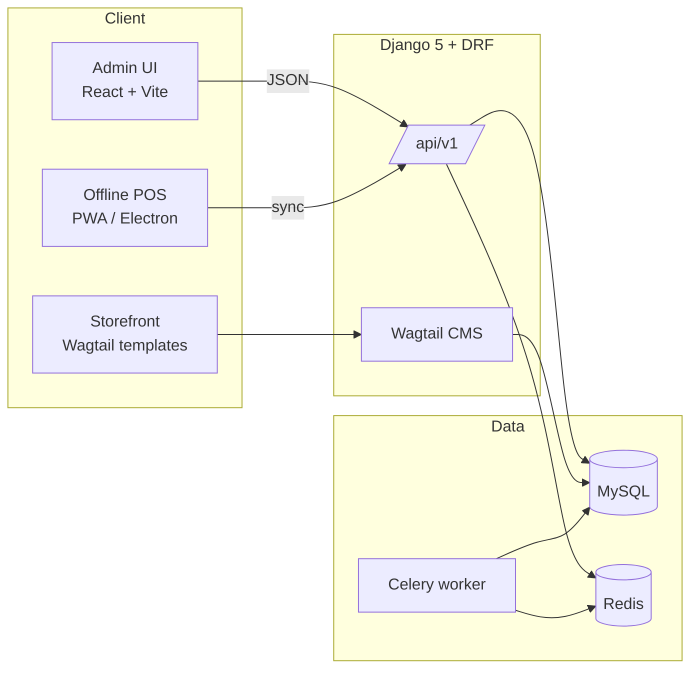

# Architecture

> Full planning document: [`doc/PROJECT_DETAILS.md`](https://github.com/SumitDerbi/asalichoice/blob/main/doc/PROJECT_DETAILS.md). Full SRS: [`doc/SOFTWARE_REQUIREMENT_SPECIFICATION_ASLI_CHOICE.md`](https://github.com/SumitDerbi/asalichoice/blob/main/doc/SOFTWARE_REQUIREMENT_SPECIFICATION_ASLI_CHOICE.md).

## High-level shape

AsliChoice is a Django + DRF backend, a React/Vite admin UI, and a Wagtail-powered storefront, deployed to a single shared host via cPanel + Passenger.



## Stack

| Layer          | Choice                                          |
| -------------- | ----------------------------------------------- |
| Backend        | Django 5, DRF, SimpleJWT, Wagtail               |
| Database       | MySQL                                           |
| Cache + broker | Redis                                           |
| Async          | Celery                                          |
| Admin UI       | React 18, Vite, TypeScript, Tailwind, shadcn/ui |
| Storefront     | Wagtail templates + Tailwind                    |
| Deployment     | cPanel + Passenger (`deploy.sh`)                |

## Conventions

- API base: `/api/v1/`.
- Error envelope: `{"error": {"code", "message", "details"}}` (see [API conventions](api/conventions.md)).
- Service layer in `apps/<module>/services.py` — views never touch the ORM for writes.
- Ledger-driven, branch-aware, soft-delete only, audit-everywhere.
- GRN-only stock writes; hard-block negative stock everywhere (including offline POS).

## Module order

Defined in [`plans/_meta.yaml`](https://github.com/SumitDerbi/asalichoice/blob/main/plans/_meta.yaml):

```
M01 → M02 → M03 → M04 → M05 → M11 → M07 → M06 → M08 → M09 → M10 →
M14 → M15 → M12 → M13 → M16 → M17 → M18 → M19 → M20
```
