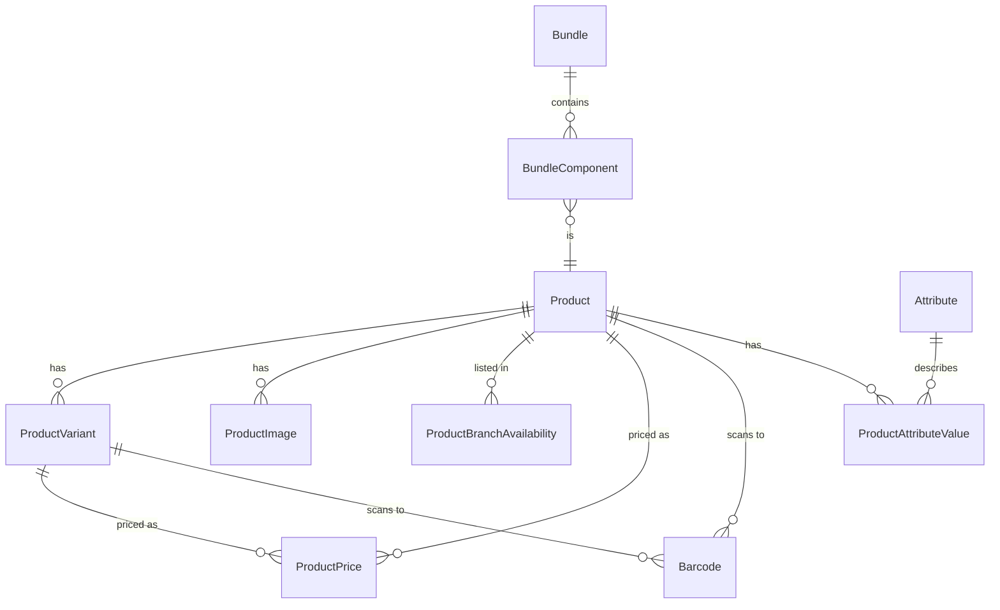

# Catalog Management (M03)

The catalog module owns products, variants, bundles, barcodes, media,
per-branch pricing & availability, and CSV import/export. It is the
source of truth every sale, every POS scan, and every store-front
page reads from.

## Scope

In scope:

- `Product` with code/sku/slug uniqueness, three lifecycle states
  (`DRAFT` / `ACTIVE` / `ARCHIVED`), brand/category/HSN/tax/base-UoM
  references into the [Master Management](../master/index.md) module.
- `ProductVariant` (size/color/SKU-per-axis), `ProductImage`,
  `ProductBranchAvailability`.
- `ProductPrice` effective-date price bands scoped to a branch, with
  an XOR constraint on `product`/`variant` (see
  [ADR-006](../../adr/006-pricing-bands.md)).
- `Bundle` (COMBO + MIX_AND_MATCH) with FIXED / SUM price policies and
  `BundleComponent` lines.
- `Barcode` (EAN13 / UPC / CODE128 / CUSTOM) with XOR product/variant.
- `Attribute` + `ProductAttributeValue` for ad-hoc taxonomy.
- CSV import with dry-run + per-row error report.

Out of scope (later modules):

- Stock + warehouse balances — `M05 inventory`.
- Vendor catalog + cost imports — `M04 vendor-purchase`.
- Promotions & coupons — phase-2.
- Storefront product pages — `M15 e-commerce` (the storefront reads
  the same models read-only).

## Entities

| Group     | Models                                          |
| --------- | ----------------------------------------------- |
| Product   | `Product`, `ProductVariant`, `ProductImage`     |
| Pricing   | `ProductPrice`, `ProductBranchAvailability`     |
| Bundles   | `Bundle`, `BundleComponent`                     |
| Discovery | `Barcode`, `Attribute`, `ProductAttributeValue` |

Every model inherits `apps.core.models.BaseModel` (soft-delete + audit
timestamps). Use `<Model>.all_objects` to see deactivated rows.

## Admin surface (`/api/v1/catalog/`)

CRUD routers (`DefaultRouter`) for every resource:

| Path                  | ViewSet                            |
| --------------------- | ---------------------------------- |
| `/products/`          | `ProductViewSet`                   |
| `/variants/`          | `ProductVariantViewSet`            |
| `/images/`            | `ProductImageViewSet`              |
| `/availability/`      | `ProductBranchAvailabilityViewSet` |
| `/prices/`            | `ProductPriceViewSet`              |
| `/bundles/`           | `BundleViewSet`                    |
| `/bundle-components/` | `BundleComponentViewSet`           |
| `/barcodes/`          | `BarcodeViewSet`                   |
| `/attributes/`        | `AttributeViewSet`                 |
| `/attribute-values/`  | `ProductAttributeValueViewSet`     |
| `/import/`            | `ImportViewSet`                    |

Custom actions worth highlighting:

| Method | Path                                | Notes                                                                                    |
| ------ | ----------------------------------- | ---------------------------------------------------------------------------------------- |
| POST   | `/products/{id}/archive/`           | Soft-archive (sets `status=ARCHIVED`). Idempotent.                                       |
| GET    | `/products/{id}/price/?branch={id}` | Effective price for the product at this branch (most-recent active band).                |
| POST   | `/prices/bulk-lookup/`              | Body: `{branch, items:[{product:id}\|{variant:id}]}`. Single-query batch for POS / cart. |
| GET    | `/barcodes/resolve/?value={raw}`    | Scanner-friendly endpoint; 404 envelope (`CAT-040`) when unknown.                        |
| POST   | `/import/`                          | Multipart `file=…` + `dry_run=true\|false`. Returns `{total, valid, created, errors[]}`. |

Search:

- `?q=` on `/products/` matches `name`, `sku`, `code`, and joined
  `barcodes__value` (with `.distinct()`).
- `?status=`, `?brand=`, `?category=` filters supported.
- `?include_inactive=true` to see soft-deleted rows.

## Pricing

See [ADR-006 — Pricing bands](../../adr/006-pricing-bands.md) for the
full rationale. In short:

- Each `ProductPrice` row is a **band** valid from `valid_from` until
  `valid_to` (open-ended if `valid_to IS NULL`).
- A band targets **either** a product **or** a variant — enforced at
  the DB via `catalog_price_xor_target` check constraint.
- `pricing_service.get_effective_price(item, branch_id, *, at=now)`
  picks the band with the highest `valid_from` that is still active
  at `at`.
- Per-(target, branch) cache uses a versioned namespace; `post_save`
  on `ProductPrice` calls `bump_version()` so the entire price cache
  is invalidated lazily.

## Caching

| Surface                 | Strategy                                                                                               |
| ----------------------- | ------------------------------------------------------------------------------------------------------ |
| Effective price lookup  | `cache_key = catalog:prices:v{N}:p{id}\|v{id}:b{branch}`; 60s TTL; bumped on every price write.        |
| Product detail (future) | Per-id key, signal-invalidated. Phase-2.                                                               |
| Master FKs              | Reuses the existing `master.cache_version` namespace (see [ADR-003](../../adr/003-branch-context.md)). |

## Audit

`apps.catalog.signals` listens for `post_save` on `Product`,
`ProductVariant`, and `ProductPrice` and emits an `AuditLog` row
through `apps.core.audit.audit(...)` — actor, branch, IP, and UA are
all pulled from the request `contextvars`. Price audit captures both
the price band and the surrounding branch context (analytics rely on
this trail).

> ⚠️ `bulk_create` (used by the CSV importer) skips post-save signals.
> The importer emits a single batched audit row at the end of a commit
> run rather than per-row.

## Permissions

| Code                   | Allows                                         |
| ---------------------- | ---------------------------------------------- |
| `catalog.view`         | All read endpoints.                            |
| `catalog.manage`       | Product/variant/image/bundle/attribute writes. |
| `catalog.price.manage` | Price band writes.                             |
| `catalog.import`       | CSV import endpoint.                           |

Seed via `python manage.py seed_permissions`.

## Admin-UI

The Catalog Management module ships at `/catalog/` with four pages:

- **Products** — list with search/status filter, drawer-edit, and an
  inline Archive action.
- **Bundles** — list with FIXED/SUM price-policy form.
- **Prices** — list with XOR product/variant create form and date
  windows.
- **Import** — CSV upload wizard with dry-run toggle and per-row
  error preview.

See the [user guide](user-guide.md) for the operator flow.
