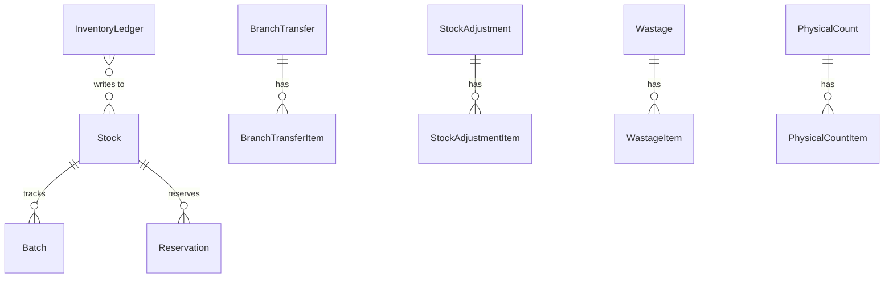

# Inventory (M05)

The inventory module owns **stock balances**, **batch / expiry
tracking**, **reservations**, **branch-to-branch transfers**, and the
three manual write seams: **adjustments**, **wastage**, and
**physical counts**. Every quantity change is journaled through a
single immutable `InventoryLedger`.

## Scope

In scope:

- `Stock` (branch + product/variant grain) with `qty_on_hand`,
  `qty_reserved`, and a computed `qty_available`. Updates are
  serialized via `SELECT … FOR UPDATE`.
- `Batch` lots with manufacture / expiry dates and `ACTIVE | EXPIRED
| CONSUMED` lifecycle; a daily management command flips lots to
  `EXPIRED`.
- `Reservation` (soft-hold) with `ACTIVE | RELEASED | CONSUMED`,
  scoped by an order or POS ticket via `ref_type` + `ref_id`.
- `BranchTransfer` + `BranchTransferItem` with the
  DRAFT → IN*TRANSIT → (PART*)RECEIVED → CANCELLED lifecycle. The
  paired stock movements happen at `dispatch` and `receive`, never
  at draft time.
- `StockAdjustment`, `Wastage`, `PhysicalCount` — three manual
  documents, all DRAFT → POSTED, all writing to the ledger and to
  `Stock` only at post time.
- `InventoryLedger` — append-only journal that **must be the only
  writer** of stock-balance deltas (see
  [ADR-008](../../adr/008-ledger-driven-stock.md)).
- A `ReasonCode` table seeded by `seed_reason_codes` to constrain
  free-text reasons on wastage / adjustments.

Out of scope (later modules):

- Sales-driven movements — M07 POS / M06 online order will route
  through the same ledger seam.
- Multi-warehouse / bin location — single branch grain for now;
  M18 will introduce sub-locations.
- Costing / valuation reports — landed cost arrives with M13.

## Entities

| Group       | Models                                               |
| ----------- | ---------------------------------------------------- |
| Balance     | `Stock`, `Batch`                                     |
| Reservation | `Reservation`                                        |
| Transfer    | `BranchTransfer`, `BranchTransferItem`               |
| Adjustments | `StockAdjustment` + `StockAdjustmentItem`            |
| Wastage     | `Wastage` + `WastageItem`                            |
| Count       | `PhysicalCount` + `PhysicalCountItem`                |
| Journal     | `InventoryLedger` (extends `LedgerEntry`, immutable) |
| Lookup      | `ReasonCode`                                         |

## Admin surface (`/api/v1/inventory/`)

| Path             | ViewSet                  | Mode              |
| ---------------- | ------------------------ | ----------------- |
| `/stock/`        | `StockViewSet`           | read-only         |
| `/batches/`      | `BatchViewSet`           | read-only         |
| `/ledger/`       | `InventoryLedgerViewSet` | read-only, cursor |
| `/reservations/` | `ReservationViewSet`     | RW                |
| `/transfers/`    | `BranchTransferViewSet`  | RW                |
| `/adjustments/`  | `StockAdjustmentViewSet` | RW                |
| `/wastage/`      | `WastageViewSet`         | RW                |
| `/counts/`       | `PhysicalCountViewSet`   | RW                |

Custom actions:

| Method | Path                          | Notes                                                  |
| ------ | ----------------------------- | ------------------------------------------------------ |
| POST   | `/reservations/{id}/release/` | ACTIVE → RELEASED.                                     |
| POST   | `/reservations/{id}/consume/` | ACTIVE → CONSUMED (paired with a sale).                |
| POST   | `/transfers/{id}/dispatch/`   | DRAFT → IN_TRANSIT. Decrements source branch stock.    |
| POST   | `/transfers/{id}/receive/`    | IN_TRANSIT / PART_RECEIVED → RECEIVED / PART_RECEIVED. |
| POST   | `/transfers/{id}/cancel/`     | DRAFT → CANCELLED.                                     |
| POST   | `/adjustments/{id}/post/`     | DRAFT → POSTED. Writes ledger + stock delta.           |
| POST   | `/wastage/{id}/post/`         | DRAFT → POSTED. Writes negative ledger + stock delta.  |
| POST   | `/counts/{id}/mark-counted/`  | DRAFT → COUNTED. Snapshots expected qty from `Stock`.  |
| POST   | `/counts/{id}/post/`          | COUNTED → POSTED. Writes diff ledger.                  |

The `/ledger/` endpoint uses **cursor pagination** (ordering `-id`)
and accepts `reason_code`, `actor`, `ref_type`, `timestamp_from`,
`timestamp_to` filters in addition to the usual `branch` /
`product` / `variant`.

## Permissions

| Codename             | Required for                          |
| -------------------- | ------------------------------------- |
| `inventory.view`     | All read endpoints                    |
| `inventory.manage`   | Default write (reservations, drafts)  |
| `inventory.adjust`   | Post stock adjustments                |
| `inventory.transfer` | Dispatch / receive / cancel transfers |
| `inventory.wastage`  | Post wastage                          |
| `inventory.count`    | Mark / post physical counts           |

Staff users currently receive every `inventory.*` permission as a
shim; superusers always bypass.

## See also

- [ADR-008 — Ledger-driven stock](../../adr/008-ledger-driven-stock.md)
- [ADR-007 — GRN-only stock write](../../adr/007-grn-only-stock-write.md)
- [`plans/phase-1-modules/M05-inventory.md`](https://github.com/SumitDerbi/asalichoice/blob/main/plans/phase-1-modules/M05-inventory.md)
