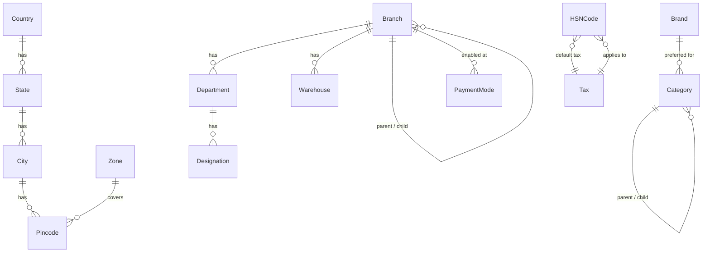

# Master Management (M01)

The master module is the canonical source for every shared lookup in the
system — geography, organisation structure, catalog support data, taxes,
and payment modes. Every downstream module (M02 users, M03 products,
M04 inventory, …) FKs into one of these entities.


## Scope

In scope:

- Geography lookups (countries, states, cities, pincodes, zones).
- Organisation entities (branches, departments, designations, warehouses).
- Catalog support data (units of measure, HSN codes, categories, brands).
- Finance lookups (taxes with GST components, payment modes per branch).
- Read-only public API and an authenticated admin API for the same models.

Out of scope (handled by later modules):

- User accounts, roles, permissions enforcement (M02).
- Product master and pricing (M03).
- Stock ledgers and warehouse movements (M04).

## Entities

| Group        | Models                                                     |
| ------------ | ---------------------------------------------------------- |
| Geography    | `Country`, `State`, `City`, `Pincode`                      |
| Organisation | `Branch`, `Department`, `Designation`, `Warehouse`, `Zone` |
| Catalog      | `UnitOfMeasure`, `HSNCode`, `Category`, `Brand`            |
| Finance      | `Tax`, `PaymentMode`                                       |

All models inherit `apps.core.models.BaseModel` → soft-delete + audit
timestamps + `created_by` / `updated_by`. Use `<Model>.all_objects` to
include soft-deleted rows.

## Entity relationships



## Public API

Read-only endpoints for storefront / public clients:

| Method | Path                                   | Notes                                 |
| ------ | -------------------------------------- | ------------------------------------- |
| GET    | `/api/v1/public/master/branches/`      | Active branches; supports `?type=`.   |
| GET    | `/api/v1/public/master/categories/`    | Tree; `?parent=` filters one level.   |
| GET    | `/api/v1/public/master/payment-modes/` | Filtered by branch via `X-Branch-Id`. |

## Admin API

All admin endpoints live under `/api/v1/master/<resource>/` and require an
authenticated staff user. The `X-Branch-Id` header binds the request to a
branch context (see `apps.master.middleware.BranchContextMiddleware`); the
current branch is available via `apps.core.context.get_current_branch()`.

## Caching

`apps.master.cache` exposes a small TTL helper used by the public API for
`branches` and `categories`. `post_save` / `post_delete` signals invalidate
related entries (`apps.master.signals`).

## Tax validation

`Tax.clean()` enforces:

- `components_json` must be a list of `{"type": "CGST|SGST|IGST|CESS",
"rate": <decimal>}` dicts.
- The sum of component rates must equal `rate_total` exactly.

## Seed data

`python manage.py seed_master` populates a representative set of countries,
states, units, taxes and payment modes. Idempotent — safe to re-run.

## Test coverage

Backend coverage on `apps.master.services` is **85.45 %**, comfortably above
the 85 % gate. Aggregate `apps.master` coverage is **88.69 %** (46 tests).
Run locally:

```bash
cd backend
pytest tests/master/ --cov=apps.master --cov-report=term-missing
```

Two files are intentionally uncovered for now:

| File             | Reason                                                              |
| ---------------- | ------------------------------------------------------------------- |
| `cache.py`       | Thin TTL wrapper; will be replaced by Redis in M18.                 |
| `permissions.py` | Branch-scoped DRF permission helpers; exercised via M02 RBAC tests. |

## See also

- [User guide](user-guide.md) — admin-UI walkthroughs.
- [Developer guide](developer-guide.md) — integrating with `apps.master`.
- [Error codes](error-codes.md) — `MST-*` envelope reference.
- [ADR-003 — Branch context](../../adr/003-branch-context.md)
- [ADR-004 — Tax components](../../adr/004-tax-components.md)
