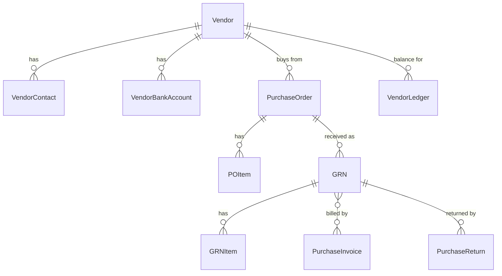

# Vendor & Purchase (M04)

The purchase module owns the **vendor master** and the procure-to-pay
document chain: Purchase Order → Goods Receipt Note (GRN) → Purchase
Invoice → Vendor Payment, plus Purchase Returns and an immutable
vendor ledger.

## Scope

In scope:

- `Vendor` master with `VendorContact` and `VendorBankAccount`
  (account number masked at save time).
- `PurchaseOrder` + `POItem` with three-tier approval thresholds
  configurable via `system_settings` key
  `purchase.po.approval_thresholds`.
- `GRN` + `GRNItem` — the **single inventory-write seam** for the
  procure cycle (see [ADR-007](../../adr/007-grn-only-stock-write.md)).
  Includes an offline submission endpoint so on-prem store devices
  can buffer receipts.
- `PurchaseInvoice` (creatable from one or more approved GRNs) with
  payment recording, partial-payment tracking, and posting to the
  vendor ledger.
- `PurchaseReturn` against an approved GRN — issues a negative ledger
  entry and (in M05 stub) a reverse stock movement.
- `VendorLedger` — immutable financial postings (inherits
  `apps.core.ledger.models.LedgerEntry`, exempt from
  `BaseModel` because each row is an append-only journal).

Out of scope (later modules):

- Stock balances and warehouse bin updates — `M05 inventory` will
  consume the hooks at GRN approve and PR post.
- Vendor catalog imports — see catalog CSV importer.
- Accounting export — `M13 accounting`.

## Entities

| Group   | Models                                            |
| ------- | ------------------------------------------------- |
| Vendor  | `Vendor`, `VendorContact`, `VendorBankAccount`    |
| PO      | `PurchaseOrder`, `POItem`                         |
| GRN     | `GRN`, `GRNItem`                                  |
| Invoice | `PurchaseInvoice`                                 |
| Return  | `PurchaseReturn`                                  |
| Ledger  | `VendorLedger` (extends `LedgerEntry`, immutable) |

## Admin surface (`/api/v1/purchase/`)

| Path         | ViewSet                           |
| ------------ | --------------------------------- |
| `/vendors/`  | `VendorViewSet`                   |
| `/pos/`      | `PurchaseOrderViewSet`            |
| `/grns/`     | `GRNViewSet`                      |
| `/invoices/` | `PurchaseInvoiceViewSet`          |
| `/returns/`  | `PurchaseReturnViewSet`           |
| `/ledger/`   | `VendorLedgerViewSet` (read-only) |

Custom actions worth highlighting:

| Method | Path                        | Notes                                                                           |
| ------ | --------------------------- | ------------------------------------------------------------------------------- |
| POST   | `/vendors/{id}/deactivate/` | Soft-archive vendor. Idempotent.                                                |
| POST   | `/pos/{id}/submit/`         | DRAFT → PENDING_APPROVAL.                                                       |
| POST   | `/pos/{id}/approve/`        | PENDING_APPROVAL → APPROVED. Checks thresholds.                                 |
| POST   | `/pos/{id}/cancel/`         | Any non-final state → CANCELLED.                                                |
| POST   | `/grns/{id}/submit/`        | DRAFT → SUBMITTED.                                                              |
| POST   | `/grns/{id}/approve/`       | SUBMITTED → APPROVED. **Writes inventory** (see ADR-007).                       |
| POST   | `/grns/{id}/reject/`        | Body `{reason}`. SUBMITTED → REJECTED.                                          |
| POST   | `/grns/sync-offline/`       | Bulk push from offline POS / store device. Idempotent via `offline_uuid`.       |
| POST   | `/invoices/from-grns/`      | Body `{vendor, branch, pi_no, grn_ids[], ...}`. Creates DRAFT invoice.          |
| POST   | `/invoices/{id}/post/`      | DRAFT → POSTED. Writes a credit ledger entry.                                   |
| POST   | `/invoices/{id}/pay/`       | Body `{amount, payment_mode}`. Records payment, updates status, debits ledger.  |
| POST   | `/returns/{id}/post/`       | DRAFT → POSTED. Writes a debit ledger entry; calls M05 stub for stock reversal. |

## Permissions

| Codename                  | Required for                       |
| ------------------------- | ---------------------------------- |
| `purchase.vendor.manage`  | Vendor CRUD + deactivate           |
| `purchase.po.manage`      | PO create/edit/submit/cancel       |
| `purchase.po.approve`     | PO approve (subject to thresholds) |
| `purchase.grn.manage`     | GRN create/edit/submit             |
| `purchase.grn.approve`    | GRN approve/reject (writes stock)  |
| `purchase.invoice.manage` | Invoice create/post                |
| `purchase.payment.record` | Record payments against invoices   |
| `purchase.return.manage`  | Returns create/post                |

Staff users currently receive every `purchase.*` permission as a
shim; superusers always bypass.

## See also

- [ADR-007 — GRN-only stock write](../../adr/007-grn-only-stock-write.md)
- [`plans/phase-1-modules/M04-vendor-purchase.md`](https://github.com/SumitDerbi/asalichoice/blob/main/plans/phase-1-modules/M04-vendor-purchase.md)
